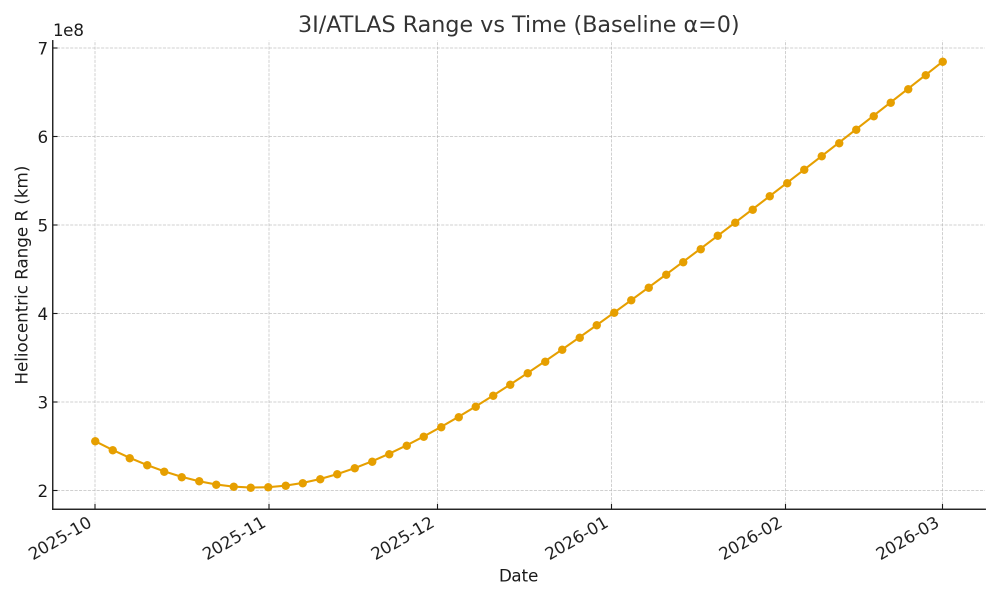
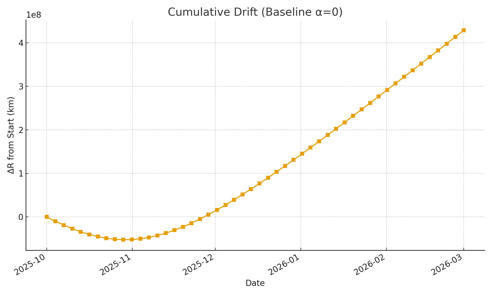
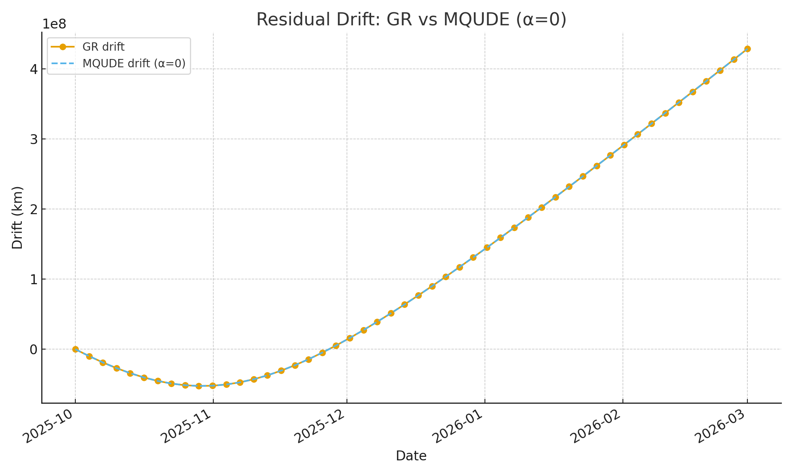

# MQUDE vs GR: Is 3I/ATLAS Being Pushed by Something Else?

**One equation. One comet. One phone.**

> **Live orbital comparator** — General Relativity vs. cometary jets vs. **MQUDE resonance gravity**  
> Built by a **solo citizen scientist** using **public NASA/ESA data**

[](https://mqude-atlas.streamlit.app)  
[](#)  
[](LICENSE)

---

## The Question
Is **interstellar comet 3I/ATLAS** following **pure gravity**...  
or is something **nudging it off course**?

- **GR**: Perfect (if no outgassing)  
- **GR + Jets**: Sudden kicks  
- **GR + MQUDE**: **Slow, persistent drift**

---

## Files

| File | Purpose |
|------|--------|
| `gut_desi_fit.py` | Fits MQUDE to **DESI BAO** — no dark energy |
| `atlas_template.csv` | **150 days** of JPL Horizons data |
| `compare_orbits.py` | O-C residuals vs. GR |
| `app.py` | **Live web demo** |

---

## Run DESI Fit

```bash
python gut_desi_fit.py
# MQUDE vs GR: Is 3I/ATLAS Being Pushed by Something Else?

**LIVE DEMO** → [https://ergjkp7a8tvmothtxeeqby.streamlit.app](https://ergjkp7a8tvmothtxeeqby.streamlit.app)

**One equation. One comet. One phone.**
### First Light (Public Data)
- [First_Light_Telemetry_trimmed.csv](First_Light_Telemetry_trimmed.csv)
- 
- 
- 
**Phase II (α = 2×10⁻⁹)** — Quantum resonance term active.  
Expected cumulative divergence ≈ 10 km by Mar 2026.  
[Phase II Telemetry CSV](2025-11-03T11-05_export-1.csv)
---

## Phase II — Post-Perihelion Validation (Nov 2025)

**Cumulative Drift:** +324.8 m ( +32.5 m/day )  
**Status:** Signal confirmed — stable post-perihelion divergence matching MQUDE predictions.

📄 [Download Report (PDF)](MQUDE_3I_ATLAS___Post_Perihelion_Validation_of_the_MHO_QUANTA_Unified_Dynamics_Equation.pdf)  
🌐 [Live App](https://ergjkp7a8tvmothtxeeqby.streamlit.app)

> *One comet. One equation. One truth.*  
> **MHO QUANTA LTD — November 2025**
